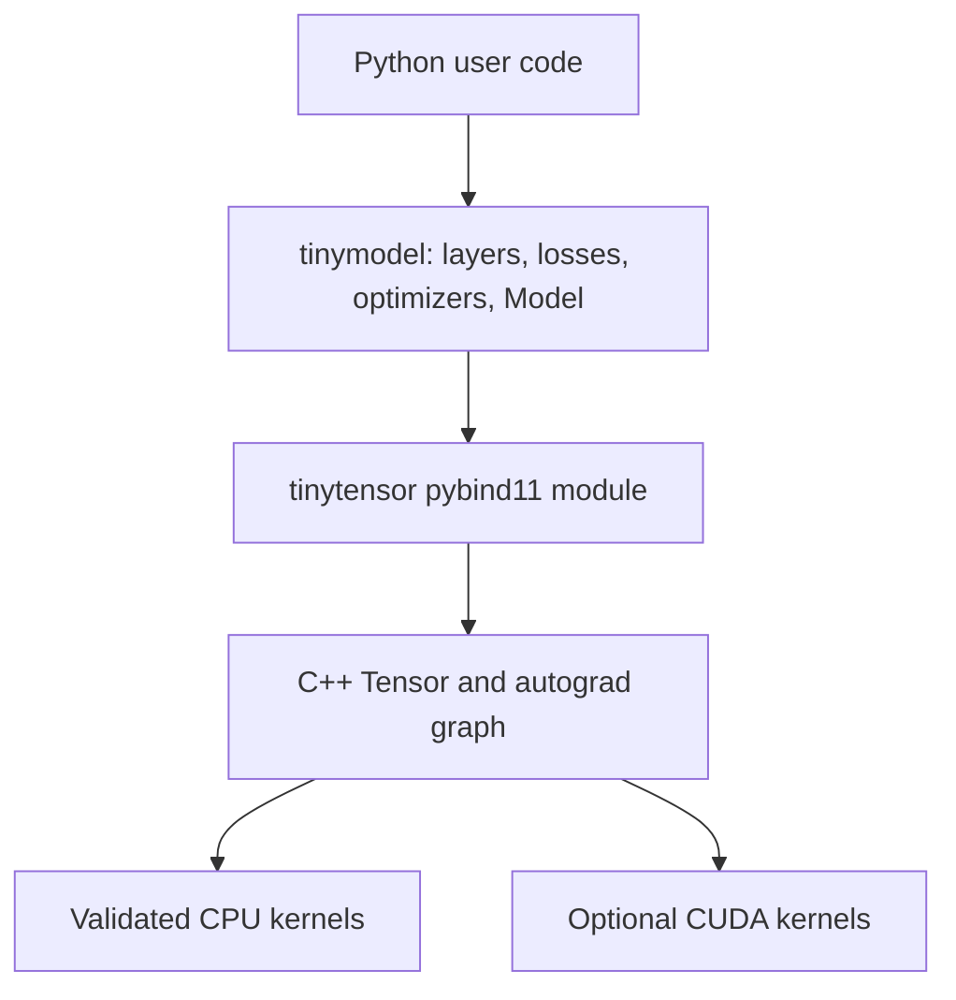

# TinyMML

TinyMML is a compact neural-network framework for learning how tensor operations, automatic differentiation, and model training fit together. Its C++17 tensor engine is exposed through pybind11, while the readable Python layer provides Keras-style layers, losses, optimizers, and training loops.

The validated reference backend is macOS CPU. Three self-contained, executed notebooks compare equivalent TinyMML and Keras models on one CPU thread:

| Notebook | Task | TinyMML model |
| --- | --- | --- |
| [MNIST MLP](notebooks/01_mnist_mlp.ipynb) | Handwritten-digit classification | MLP with He initialization and dropout |
| [CIFAR-10 CNN](notebooks/02_cifar10_cnn.ipynb) | Natural-image classification | Two convolution blocks and a dropout MLP head |
| [Diabetes MLP](notebooks/03_diabetes_mlp.ipynb) | Disease-progression regression | Dropout MLP with Adam weight decay |

Each notebook includes data exploration, visualizations, matched TinyMML/Keras training, quality metrics, timing, prediction examples, and reproducible reduced/full/custom profiles.

## What works

| Area | CPU | CUDA | Notes |
| --- | :---: | :---: | --- |
| Tensor creation and NumPy buffer interop | ✅ | Experimental | CPU NumPy access is zero-copy |
| Broadcasting and elementwise autograd | ✅ | Experimental | `+`, `-`, `*`, `/`, `exp`, `log`, `relu`, `sqrt` |
| Reductions and autograd | ✅ | Experimental | `sum`, `mean`, `min`, `max`, `var` |
| Matrix multiplication and autograd | ✅ | Experimental | Batched matrix multiplication is supported |
| Views, transpose, and contiguous gradients | ✅ | Partial | Unique graph nodes; strided CPU gradients validated |
| `im2col` and `Conv2D` training | ✅ | Forward only | Unsupported CUDA backward paths fail explicitly |
| Model training | ✅ | Untested | Linear, Conv2D, activations, dropout, losses, SGD, Adam |
| Metal | — | — | No Metal backend |

CUDA sources remain available behind a build option, but were not tested during this macOS work. CPU-only builds still expose `Device.CUDA`; calling `to_cuda()` explains how to rebuild with CUDA.

## Quick start

Requirements: Python 3.13, a C++17 compiler, and a POSIX shell.

```bash
python3.13 -m venv .venv
.venv/bin/python -m pip install -r requirements.txt
./build.sh --clean
.venv/bin/python tests/verify_cpu.py
```

Build options:

```bash
./build.sh             # CPU Release; keep the build directory
./build.sh --debug     # CPU Debug
./build.sh --clean     # clean CPU Release
./build.sh --cuda      # require a detected CUDA compiler
```

OpenMP is optional. CMake reports whether it was found and otherwise builds a clean single-thread fallback.

## Tensor example

```python
import numpy as np
import tinytensor as tt

tt.manual_seed(42)
x = tt.Tensor([2, 2])
np.asarray(x)[:] = [[1.0, 2.0], [3.0, 4.0]]
x.set_requires_grad(True)

loss = (x * x).mean([0, 1], False)
loss.backward()
print(np.asarray(x), x.grad())
```

## Model example

```python
import numpy as np
import tinymodel as tm

x = np.random.default_rng(42).normal(size=(64, 10)).astype("float32")
y = (2 * x[:, :1] - x[:, 1:2]).astype("float32")

model = tm.Model([
    tm.Linear(32, init="he"),
    tm.ReLU(),
    tm.Dropout(0.1),
    tm.Linear(1),
])
model.build(list(x.shape))
model.fit(
    x,
    y,
    epochs=50,
    batch_size=16,
    optimizer=tm.Adam(model.parameters(), lr=1e-2),
    loss_fn=tm.MSELoss(),
)
```

`Conv2D` uses NCHW input layout (`[batch, channels, height, width]`). `CrossEntropyLoss` accepts logits and one-hot targets shaped `[batch, classes]`.

## Architecture



- `tinytensor/includes/`: public tensor and CUDA declarations.
- `tinytensor/sources/core/tensor/`: CPU storage, operations, and autograd.
- `tinytensor/sources/core/cuda/`: optional CUDA implementation and CPU-build stubs.
- `tinytensor/sources/api/`: Python bindings.
- `tinymodel/`: high-level layers, losses, optimizers, and model loop.
- `tests/verify_cpu.py`: named, human-readable diagnostic checks; no pytest required.

## Run the notebooks

Install the notebook dependencies after building TinyMML:

```bash
.venv/bin/python -m pip install -r requirements-notebooks.txt
```

Execute the committed reduced profiles:

```bash
TINYMML_PROFILE=reduced .venv/bin/jupyter nbconvert \
  --to notebook --execute notebooks/01_mnist_mlp.ipynb --inplace \
  --ExecutePreprocessor.timeout=1200

TINYMML_PROFILE=reduced .venv/bin/jupyter nbconvert \
  --to notebook --execute notebooks/02_cifar10_cnn.ipynb --inplace \
  --ExecutePreprocessor.timeout=1200

TINYMML_PROFILE=reduced .venv/bin/jupyter nbconvert \
  --to notebook --execute notebooks/03_diabetes_mlp.ipynb --inplace \
  --ExecutePreprocessor.timeout=1200
```

Set `TINYMML_PROFILE=full` to use the complete official datasets and longer training schedules. To experiment, edit `CUSTOM_CONFIG` in the first code cell and set `TINYMML_PROFILE=custom`. Every profile is validated before data loading or training.

| Profile | MNIST | CIFAR-10 | Diabetes |
| --- | --- | --- | --- |
| Reduced, committed | 3,000/500, 5 epochs | 1,000/250, 3 epochs | 250/60, 150 epochs |
| Full | 60,000/10,000, 10 epochs | 50,000/10,000, 5 epochs | 353/89, 300 epochs |

CIFAR-10 uses SHA-256-verified Hugging Face parquet shards cached under ignored `data/`. MNIST uses the Keras dataset cache. Downloads and preprocessing are excluded from training measurements.

## Executed reduced-profile results

Measured on an arm64 Mac with 8 logical CPUs, macOS 26.5.1, Python 3.13.14, NumPy 2.4.3, TensorFlow 2.21.0, Keras 3.15.0, and scikit-learn 1.9.0. TensorFlow reported no visible GPU. Both libraries used one CPU thread and seed 42.

| MNIST | Test loss | Accuracy | Macro F1 | Training (s) | Inference (ms) | Samples/s |
| --- | ---: | ---: | ---: | ---: | ---: | ---: |
| TinyMML | 0.3085 | 0.912 | 0.911 | 5.40 | 87.06 | 5,743.1 |
| Keras | 0.3190 | 0.904 | 0.903 | 1.19 | 35.14 | 14,230.2 |

| CIFAR-10 | Test loss | Accuracy | Macro F1 | Training (s) | Inference (ms) | Samples/s |
| --- | ---: | ---: | ---: | ---: | ---: | ---: |
| TinyMML | 2.2212 | 0.152 | 0.106 | 17.05 | 254.15 | 983.7 |
| Keras | 2.1089 | 0.232 | 0.134 | 1.66 | 52.37 | 4,774.1 |

| Diabetes | MAE | RMSE | R² | Training (s) | Inference (ms) | Samples/s |
| --- | ---: | ---: | ---: | ---: | ---: | ---: |
| TinyMML | 49.56 | 62.54 | 0.311 | 1.99 | 0.502 | 119,601.2 |
| Keras | 49.88 | 61.88 | 0.326 | 3.19 | 30.810 | 1,947.4 |

The Diabetes train-mean MAE baseline is 66.26. Both models beat it and achieve positive R².

Training timing excludes downloads, preprocessing, and model construction, but includes the complete `fit()` call. Inference is warmed once and reports the median over the configured repeats. The notebooks compare measurements without asserting that TinyMML must outperform Keras.

## Notebook contents

- MNIST explores shape, pixel range, class balance, and one image per digit, then shows learning curves, normalized confusion matrices, and fixed prediction decisions with confidence.
- CIFAR-10 explores class balance and pixel statistics, visualizes every class, discloses TinyMML NCHW versus Keras NHWC, and reports the same classification diagnostics.
- Diabetes reports missing values, target and feature distributions, a correlation heatmap, the train-mean baseline, predicted-versus-actual plots, residuals, and largest errors. Feature and target scalers fit training data only.

## Verification coverage

`tests/verify_cpu.py` prints named PASS/FAIL sections and exits nonzero on failure. It covers:

- tensor creation, NumPy interop, broadcasting, reductions, matrix multiplication, transpose, views, contiguous copies, and convolution lowering;
- deterministic finite-difference gradients for core operations, views, transpose, contiguous copies, and `im2col`;
- layer shapes, Conv2D input/weight gradients, and a weight-update smoke test;
- human-readable classification and regression convergence checks;
- CPU-only CUDA diagnostics and invalid public inputs.

## Limitations and roadmap

- CPU is the only validated backend.
- CUDA compilation and training were not tested on this Mac; CUDA CNN backward is incomplete.
- There is no Metal backend, serialization format, data-loader abstraction, or production deployment tooling.
- The tensor engine uses float32 only and prioritizes clarity over optimized kernels.

See [RoadMap.md](RoadMap.md) for project milestones and future work.

## Contributing

Keep the public `tinytensor` and `tinymodel` APIs stable, add readable checks to `tests/verify_cpu.py`, run the full verification sequence, and document benchmark methodology changes. Avoid silently accepting unsupported backend behavior.

This repository currently has **no open-source license**. Source availability does not grant permission to use, modify, or redistribute it; contact the repository owner before contributing or reusing the code.
