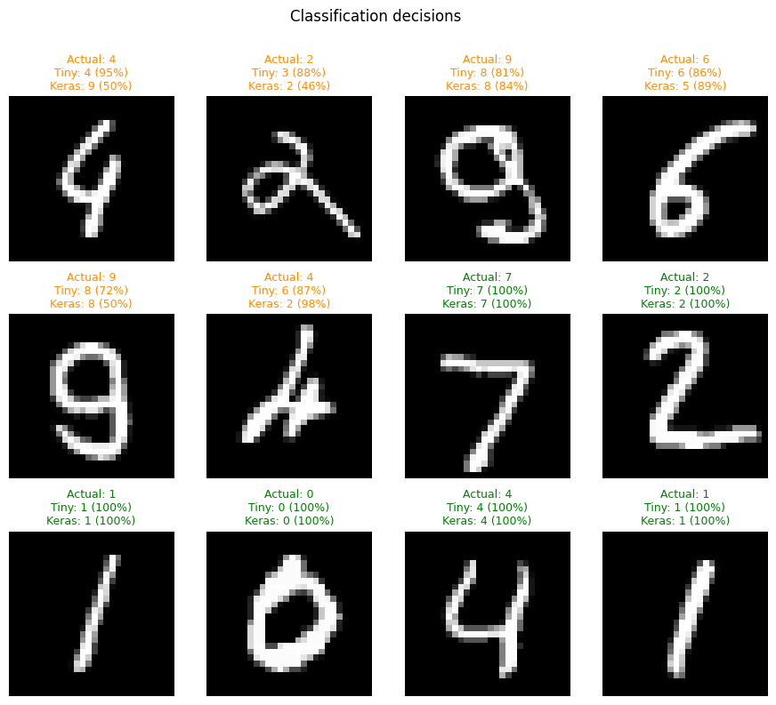
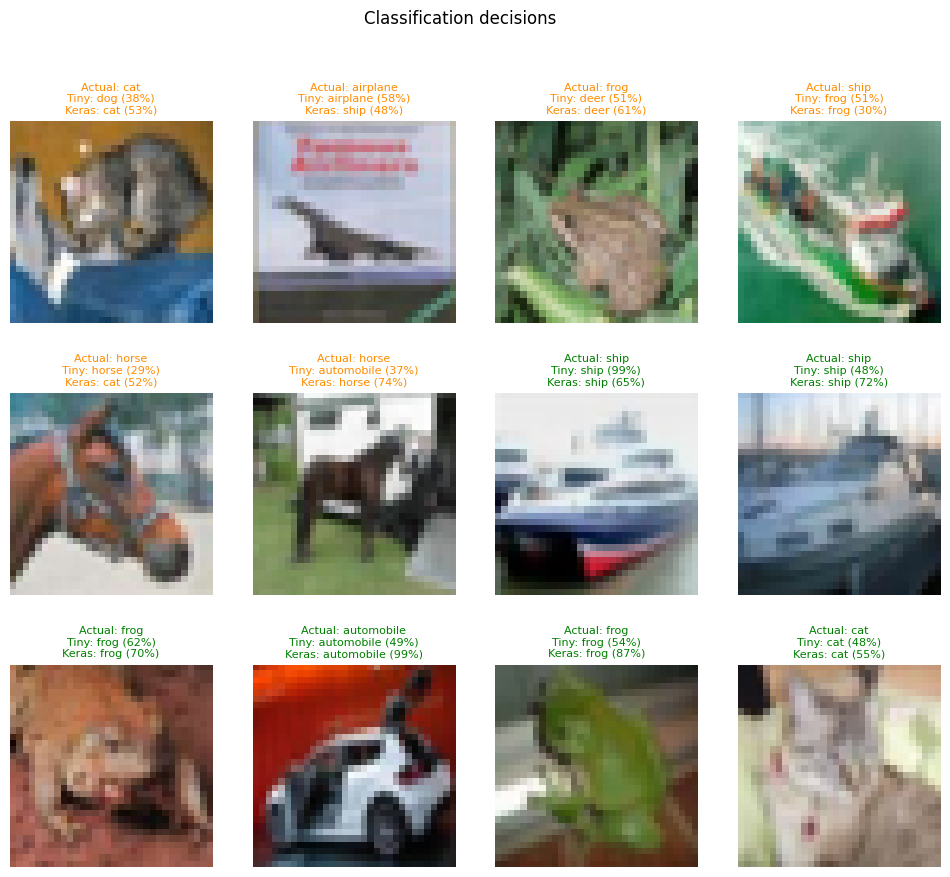
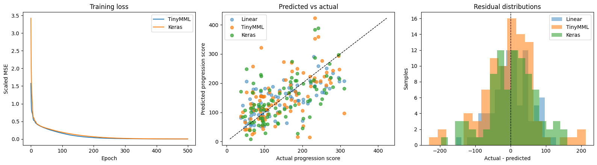
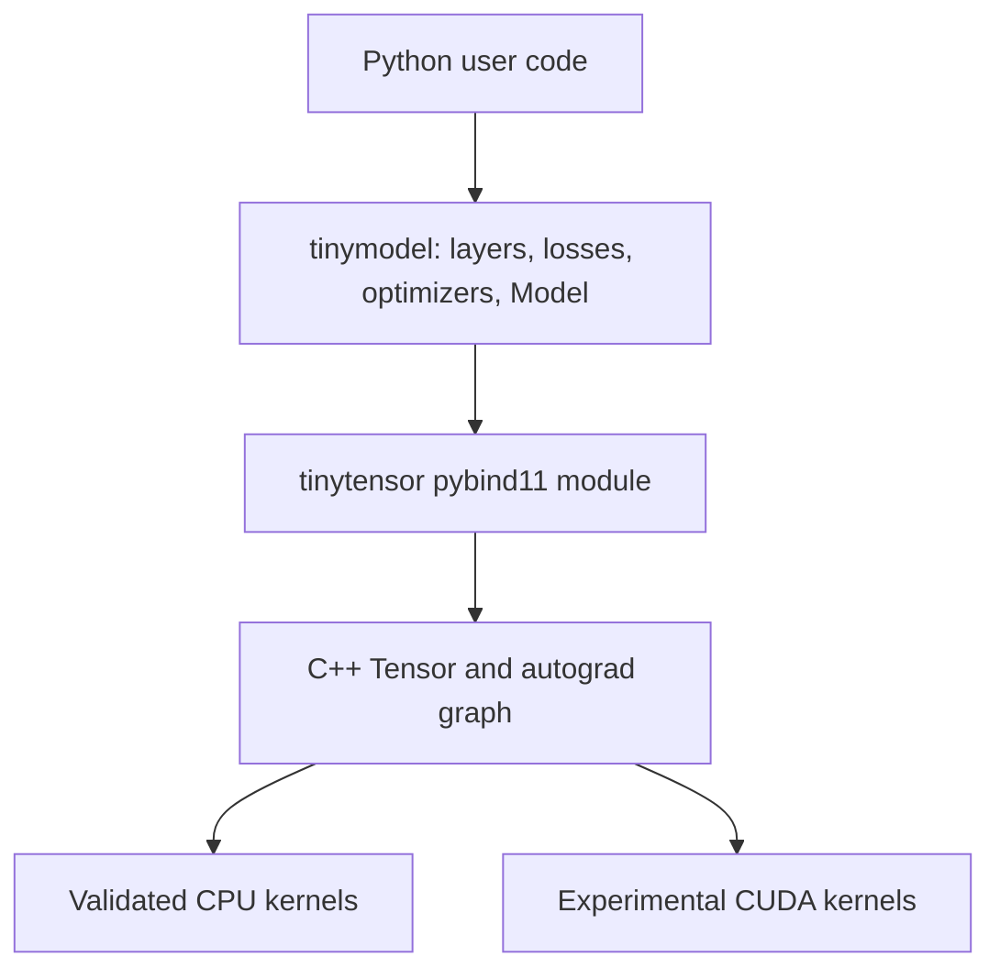

# TinyMML

TinyMML is a compact neural-network framework built to make tensor operations, automatic differentiation, and model training understandable end to end. A C++17 tensor engine provides the numerical core through pybind11, while a readable Python layer exposes Keras-style layers, losses, optimizers, and training loops.

Its notebooks compare equivalent TinyMML and Keras models without hiding preprocessing, tensor layouts, metrics, or timing methodology.

## See it work

| MNIST digit decisions | CIFAR-10 image decisions |
| --- | --- |
|  |  |



The classification grids compare individual TinyMML and Keras decisions. The regression diagnostic shows learning curves, predicted progression scores, and residual distributions from the fixed reference configuration.

## Technical highlights

- C++ tensors with NumPy buffer interoperability and reverse-mode automatic differentiation.
- Broadcasting, reductions, matrix multiplication, views, transpose, contiguous copies, and convolution lowering.
- Trainable `Linear` and `Conv2D` layers with activations, dropout, SGD, Adam, and common losses.
- Matched TinyMML/Keras notebooks for classification, convolution, and regression.
- Named CPU verification checks covering numerical behavior, gradients, training, and error handling.

## Quick start

Requirements: Python 3.13, a C++17 compiler, and a POSIX shell.

```bash
python3.13 -m venv .venv
.venv/bin/python -m pip install -r requirements.txt
./build.sh --clean
.venv/bin/python tests/verify_cpu.py
```

`./build.sh` creates a CPU Release build. Use `--debug`, `--clean`, or `--cuda` for the corresponding build variants. OpenMP is optional; CMake reports whether it is available and otherwise builds a single-thread fallback.

## Notebooks

The notebooks are generated with outputs. Set the `PROFILE` variable to `"reduced"` for a quick run or `"full"` for the complete run.

| Notebook | Dataset/Goal | Model |
| --- | --- | --- |
| [MNIST MLP](notebooks/mnist_mlp.ipynb) | Classify 28 × 28 grayscale digits | Small `32 → 16 → 10` MLP |
| [CIFAR-10 CNN](notebooks/cifar10_cnn.ipynb) | Classify 32 × 32 RGB images across ten classes | Two convolution blocks and a dense head |
| [Diabetes regression](notebooks/diabetes_mlp.ipynb) | Estimate disease progression one year after baseline | Linear reference plus `100 → 100` MLP |

| Profile | MNIST | CIFAR-10 | Diabetes |
| --- | --- | --- | --- |
| Reduced, default | 3,000/500, 5 epochs | 1,000/250, 3 epochs | 250/60, 150 epochs |
| Full | 60,000/10,000, 10 epochs | 50,000/10,000, 10 epochs | 353/89, 500 epochs |

## Architecture



- `tinytensor/` contains tensor storage, operations, autograd, CPU/CUDA kernels, and Python bindings.
- `tinymodel/` contains the readable high-level training API.
- `notebooks/` contains the three framework comparisons.
- `tests/verify_cpu.py` contains the standalone CPU verification suite.

## Benchmark

The notebooks disable GPU execution but do not force OpenMP, BLAS, or TensorFlow thread counts. Each runtime uses automatic CPU parallelism, so timings remain hardware-dependent.

Training measurements include the complete `fit()` call but exclude downloads, preprocessing, and model construction. Inference is warmed once and reports the median of several runs.

Keras can be substantially faster because TensorFlow uses mature, optimized, and fused CPU kernels. TinyMML deliberately keeps its educational kernels and training flow explicit.

## Current scope

| Area | Status |
| --- | --- |
| CPU tensor operations and autograd | Validated |
| Dense and convolutional model training | Validated on CPU |
| NumPy interoperability | Validated; CPU access is zero-copy |
| CUDA | Experimental; CNN backward paths remain incomplete |
| Metal, serialization, deployment tooling | Not implemented |

TinyMML currently uses float32 and prioritizes clarity over production-level kernel optimization.
