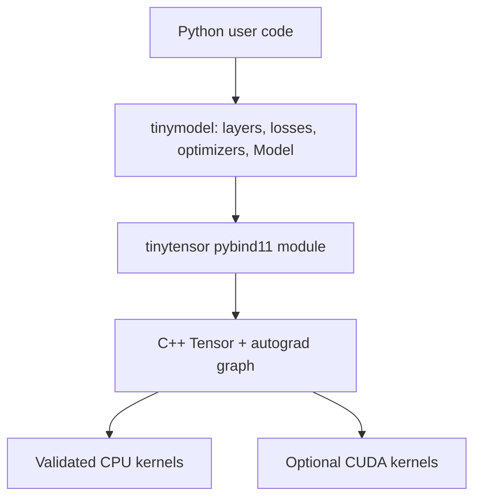

# TinyMML

TinyMML is a compact neural-network framework built to make tensor operations, automatic differentiation, and model training readable end to end. A C++17 tensor engine is exposed through pybind11; a small Python layer supplies Keras-style layers, losses, optimizers, and training loops.

The validated reference backend is macOS CPU. The repository includes a reproducible [CIFAR-10 and Diabetes showcase](notebooks/tinymml_showcase.ipynb) comparing TinyMML with Keras/TensorFlow on one CPU thread.

## What works

| Area | CPU | CUDA | Notes |
| --- | :---: | :---: | --- |
| Tensor creation and NumPy buffer interop | ✅ | Experimental | CPU NumPy access is zero-copy |
| Broadcasting and elementwise autograd | ✅ | Experimental | `+`, `-`, `*`, `/`, `exp`, `log`, `relu`, `sqrt` |
| Reductions and autograd | ✅ | Experimental | `sum`, `mean`, `min`, `max`, `var` |
| Matrix multiplication and autograd | ✅ | Experimental | Batched matrix multiplication is supported |
| Views, transpose, and contiguous gradients | ✅ | Partial | Unique graph nodes; strided CPU gradients validated |
| `im2col` and `Conv2D` training | ✅ | Forward only | CUDA backward fails explicitly instead of dropping gradients |
| High-level model training | ✅ | Untested | `Linear`, `Conv2D`, activations, normalization, losses, SGD, Adam |
| Metal | — | — | No Metal backend |

CUDA sources remain available behind a build option, but CUDA was not tested during this macOS refactor. CPU-only builds still expose `Device.CUDA`; calling `to_cuda()` explains how to rebuild with CUDA.

## Quick start

Requirements: Python 3.13, a C++17 compiler, and a POSIX shell.

```bash
python3.13 -m venv .venv
.venv/bin/python -m pip install -r requirements.txt
./build.sh --clean
.venv/bin/python python/verify_cpu.py
```

Build options:

```bash
./build.sh             # CPU Release; keep the build directory
./build.sh --debug     # CPU Debug
./build.sh --clean     # clean CPU Release
./build.sh --cuda      # require a detected CUDA compiler
```

OpenMP is optional. CMake reports whether it was found and otherwise builds a clean single-thread fallback.

## Tensor example

```python
import numpy as np
import tinytensor as tt

tt.manual_seed(42)
x = tt.Tensor([2, 2])
np.asarray(x)[:] = [[1.0, 2.0], [3.0, 4.0]]
x.set_requires_grad(True)

loss = (x * x).mean([0, 1], False)
loss.backward()
print(np.asarray(x), x.grad())
```

## Model example

```python
import numpy as np
import tinymodel as tm

x = np.random.default_rng(42).normal(size=(64, 10)).astype("float32")
y = (2 * x[:, :1] - x[:, 1:2]).astype("float32")

model = tm.Model([
    tm.Linear(32, init="he"),
    tm.ReLU(),
    tm.Linear(1),
])
model.build(list(x.shape))

history = model.fit(
    x,
    y,
    epochs=50,
    batch_size=16,
    optimizer=tm.Adam(model.parameters(), lr=1e-2),
    loss_fn=tm.MSELoss(),
    verbose=True,
)
```

`Conv2D` inputs use NCHW layout (`[batch, channels, height, width]`). `CrossEntropyLoss` accepts logits and one-hot targets with shape `[batch, classes]`.

## Architecture



- `tinytensor/includes/`: public tensor and CUDA declarations.
- `tinytensor/sources/core/tensor/`: CPU storage, broadcasting, operations, and autograd.
- `tinytensor/sources/core/cuda/`: optional CUDA implementation and CPU-build stubs.
- `tinytensor/sources/api/`: Python bindings.
- `tinymodel/`: readable high-level neural-network API.
- `python/verify_cpu.py`: reproducible named diagnostic checks, designed for interactive debugging rather than pytest.

## Reproducible showcase

Install demo dependencies and execute the committed quick profile:

```bash
.venv/bin/python -m pip install -r requirements-demo.txt
.venv/bin/jupyter nbconvert \
  --to notebook --execute notebooks/tinymml_showcase.ipynb --inplace \
  --ExecutePreprocessor.timeout=1200
```

Use `TINYMML_PROFILE=full` for 10,000/2,000 CIFAR-10 samples, five CIFAR epochs, 300 Diabetes epochs, and ten inference repeats. CIFAR-10 is downloaded as verified Hugging Face parquet shards and cached under ignored `data/`.

### Executed quick-profile results

Measured on an arm64 Mac with 8 logical CPUs, macOS 26.5.1, Python 3.13.14, NumPy 2.4.3, TensorFlow 2.21.0, Keras 3.15.0, and scikit-learn 1.9.0. TensorFlow reported no visible GPU. Both libraries were restricted to one CPU thread and seeded with 42.

The initial 2,000/500 CIFAR profile exceeded ten minutes because the default Keras dataset host was unavailable inside the restricted environment. Per the benchmark policy, the committed run records the fallback profile: 1,000 train samples, 250 test samples, three epochs, batch size 32, and five inference repeats.

| CIFAR-10 | Accuracy | Training (s) | Median inference (ms) | Samples/s |
| --- | ---: | ---: | ---: | ---: |
| TinyMML | 0.220 | 6.36 | 79.77 | 3,133.9 |
| Keras | 0.276 | 1.28 | 10.32 | 24,225.0 |

| Diabetes | MAE | RMSE | R² | Training (s) | Median inference (ms) | Samples/s |
| --- | ---: | ---: | ---: | ---: | ---: | ---: |
| TinyMML | 53.53 | 69.95 | 0.076 | 1.50 | 0.406 | 219,121.7 |
| Keras | 50.49 | 70.31 | 0.067 | 4.91 | 1.828 | 48,699.3 |

The Diabetes train-mean MAE baseline was 64.01. Timings exclude downloads, preprocessing, and model construction; include complete `fit()` calls; warm inference once; and report the median. TinyMML is educational software, while TensorFlow is highly optimized, so the benchmark has no speed-win assertion.

## Verification coverage

`python/verify_cpu.py` prints a named PASS/FAIL section and exits nonzero on failure. It covers:

- tensor creation, NumPy interop, broadcasting, reductions, matrix multiplication, transpose, views, contiguous copies, and convolution lowering;
- deterministic finite-difference gradients for core operations, views, transpose, contiguous copies, and `im2col`;
- layer shapes, Conv2D input/weight gradients, and a weight-update smoke test;
- human-readable classification and regression convergence checks;
- CPU-only CUDA diagnostics and invalid public inputs.

## Limitations and roadmap

- CPU is the only validated backend.
- CUDA compilation and training were not tested on this Mac; CUDA CNN backward is incomplete.
- There is no Metal backend, serialization format, data-loader abstraction, or production deployment tooling.
- The tensor engine uses float32 only and prioritizes clarity over optimized kernels.

See [RoadMap.md](RoadMap.md) for verified milestones and next work.

## Contributing

Keep public `tinytensor` and `tinymodel` APIs stable, add readable checks to `python/verify_cpu.py`, run the full verification sequence, and document benchmark methodology changes. Avoid silently accepting unsupported backend behavior.

This repository currently has **no open-source license**. Source availability does not grant permission to use, modify, or redistribute it; contact the repository owner before contributing or reusing the code.
